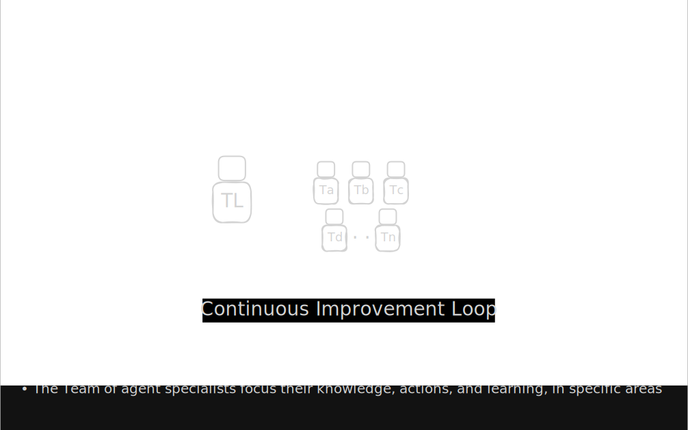
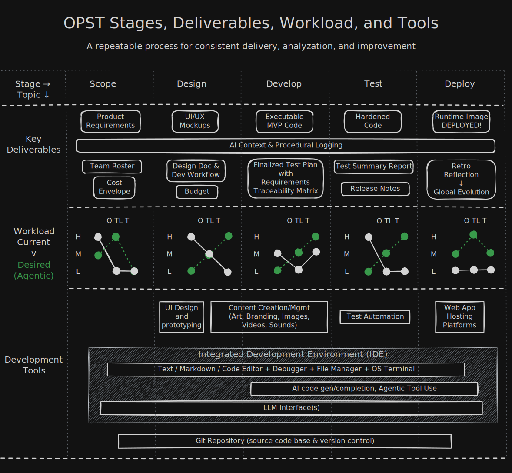

# One Person Software Team - Rudi Lewis

This repo captures how I'm building an AI software team and improving the agentic workflows iteratively over a number of projects.

## Project Goals

1. My current goal is to create __*silky smooth agent-powered workflows*__, specifically in the software space. To achieve this, I'll iterate on my current clunky workflows, as I work through useful and/or fun projects that serve a productivity and/or entertainment purpose in my life and those around me.

2. My midrange goal is to build or join a viable business with the hardened team and workflows I create, with like-minded individuals who want to steer the world toward human/AI harmony, and hopefully __NOT__ "Beyond Thunderdome".

3. My longterm goal isn't to replace software engineers with AI, but to greatly expand the skills, range, and speed with which each engineer can create, develop, and deploy for any project. You can see more about [my background](./docs/RLbackground.md) and how it's inspired me to go down this path.

## Project Concepts

The strategy is to build __one team__ that grows its __knowledge, memory, and teamwork__ as it works through successive projects.

### Team Memory is Key

> The team and the process should be uncoupled from the AI-enabled product development tool "stack" it is using. In other words, the knowledge and skills and process flows stay with the team, and they should be able to plug and play into different dev languages, tools, and tool environments, depending on the project, while always maintaining access to their process, skills, tools, and their "memory" of what they've learned through successful AND non-successful projects.

### The Team

* __Product Owner__: the human in the loop, ultimately responsible for what the team creates and the tools and resources the team can access to achieve their goals
* __Team Lead Agent__: drives what the team creates __and documents the team's learning path__, mostly functioning as an orchestrator looking for ways the Product Owner, Team Lead, and Team can communicate and improve
* __Team Specialist Agents__: The great project management instructor [David McLachlan](https://www.youtube.com/channel/UC8uqqZwyoW303ZeWyUiNdMg) always talks about the agile scrum concept of "T-shaped people", who are good generalists but have a few skills they can go drill deeper than others in the team, so that we get great coverage. Our team is comprised of "T-shaped agents", they are all fluent in any of the coding languages, and can be assigend general tasks, but each has a specialty such as security or databases or testing.

### The Process

Using good project management skills, the team will move projects from stage to stage with key deliverables. __Crucially, the team must maintain a continuous log of actions, technical hurdles, and decisions in the project's `LOCAL_LOG.md` file across all of these stages.__

* Scope: Defines the customer, the project, and the feasability.
  * What we're building and most importantly __*who we're building it for*__ goes into a __Product Requirements Document__
    * Getting to a good PRD is a challenge, we do it through a `project-kickoff` workflow that includes a `prd` skill.
  * Who we're going to need on the team for this project and their persona of skills goes into a __Team Roster__
  * What's it going to cost (in time and money) goes into a preliminary __Budget__ table
* Design: Defines what the end product will look like and how we get there. Should give us enough of a feel that we feel confident in starting to build
  * The technical frameworks, diagrams, and tasks go into a __Design Doc__
  * The graphical design and flow go into wireframes aka __UI/UX Mockups__
* Development:
  * Deliver minimum viable product code that is functional, and ready to test end-to-end
* Test: Use a combination of automated, agentic, and manual testing to sniff out bugs and problematic flows
  * Deliver "hardened" code that passes all user requirements for this version of the software.
* Deploy. All of this is hokum if we don't __ship real code__.
  * hosting options and service price envelopes
  * important to end the project with __Reflection__ and analysis that feeds back via a continuous improvement loop

> As you can see from the "workload" section of the diagram, with a move to agentic teams we're trying to "right-size" the human involvement and maximize the team involvement at every stage.

### The Dev Tools (Multi-Stack Strategy)

As mentioned in Team Memory, the team should be decoupled from any particular toolset. That opens the door for using multiple toolset configuration and being able to rapidly move to best in class advancements.

>For now, I'm provisioning a "Google stack" that uses Google products for the LLM and  the dev tools mentioned in the graphic (wherever possible), __and a second "Claude stack"__, that uses Anthropic products and best-in-class MCP integrations for its tool makeup.

Again, a key goal of Team Memory is to make sure that we're able to learn, adapt, and deliver regardless of the toolset, so learning how to do that is a major step in this Rev 0.4 of the process.

For more details about the specific dev tools in my environment, see [docs/devTools.md](./docs/devTools.md)

### The Digital Footprint

This is all good in theory but how do the bits/bytes actually come together.

#### The Workbench

The folders and files for my OPST installation. see [docs/bitsAndBytes.md](./docs/bitsAndBytes.md)

#### The Runtime

The source code can be either PERN, Python/Flask, or a combination of the two.
(And really, it can be anything, those are just the two that I'm familiar and feel comfortable working in.)
The runtimes can be deployed to any cloud provider, or run locally.
See [docs/appHosting.md](./docs/appHosting.md) for more details.

## Project Log (most recent first)

### Rev 0.4: One Team, Two Dev Stacks (Feb 2026)

With only a couple weeks left in the Python 100 Days Course, the assignments get more complex. Which means there's a lot of learning and growing I'm missing out on by not having a team suffer through it together 🙂. It's time to transition to agentic teams.
We'll optimize the human workload and focus where it's advantageous to have the human thinking (creativity and strategy), while continuously optimizing the AI processes to take on everything else from the human (project management, coding, testing, deployment, marketing, support, accounting, and so on.) We'll optimize the development environment to try to use Google end-to-end in one instance, and Anthropic (Claude) plus best-in-class MCP connections for another stack. The intent is that either stack can be run on any project (not looking to combine stacks for phases/sections of a project...yet!)

* [tic-tac-toe](https://github.com/rudil24/tic-tac-toe) Completed using OPST 0.4 logic via Gemini Antigravity IDE
* [img-watermark](https://github.com/rudil24/img-watermark) Completed using Tkinter/Pillow backend logic via Google Antigravity & AI Studio Gen Image
* [typing-test](https://github.com/rudil24/typing-test) Completed using TKinter via Claude Code (first day on the job with Claude!)
* [buzz-arcade](https://github.com/rudil24/buzz-arcade) First game "Ice-Out" completed using Pygbag/Python backend logic via Google Antigravity and a variety of LLM models (Gemini 3.1 Pro High, Pro Low, Pro Planning, and when those tokens ran out, Sonnet 4.6)
* [cafe-wifi](https://github.com/rudil24/cafe-wifi) Coffee shop London database in python/flask (Claude Code assisted)

### Rev 0.3: I Plan, You Do (Jan 2026)

I worked through the first 80 days of Python 100 Days of Code learning the Python language while refining my approach. I tried to NOT do interactive chats (other than for bug convos), and NOT to focus on the pseudo-team, but work on the planning and setup to give the AI everything they needed to "go do". This led to a good project flow of me delivering a single prompt that pointed Gemini to the project README.md that served as kind of a combined Product Requirements Doc and Design/Dev Workflow doc. Here are examples of this "README.md" and the dev workflows it drove to highly successful outcomes:

* [day031](https://github.com/rudil24/pythonCourse/tree/main/solutions/day031) Language Flash Cards desktop app
* [day064](https://github.com/rudil24/pythonCourse/tree/main/solutions/day064) Top 10 Movies database/web app
* [day082](https://github.com/rudil24/morse_code) Morse code Translator terminal-based app

These were all pretty straightforward projects without the need for a lot of design, planning, and user testing, so the "1-pager" README really worked well. It will be interesting to see how far I can take that paradigm.

### Rev 0.2: Anatomy of a Team (Oct 2025)

I worked with Gemini 2.5 to create a ["team" roster (initial version)](https://github.com/rudil24/guestbook/tree/main/team) and we worked together through interactive prompts to create a simple javascript full stack [guestbook demo](https://github.com/rudil24/guestbook). I envisioned having an agent lead the action of agent experts. But all it really became was me talking to Gemini in a chat pane, then Gemini would drop below the counter and put on a new hat like a Monty Python hotel sketch. I had to "Deactivate agent Stella. Activate agent Nexus" and micro-manage almost every task. It got the project done, but with too much effort on my part.

### Rev 0.1: Vibe + Chat (Aug 2025)

My first effort wasn't really a team as much as a Gemini chat session to build a quick & dirty 100% client-side [fantasy draft ping pong ball hopper](https://github.com/rudil24/draftballs), as I was learning the React front-end library. It helped me see I wanted something more than chat + vibing to make things, I wanted to build a world class AI scrum team.

<!--
## References

* [words](link)
-->
---
