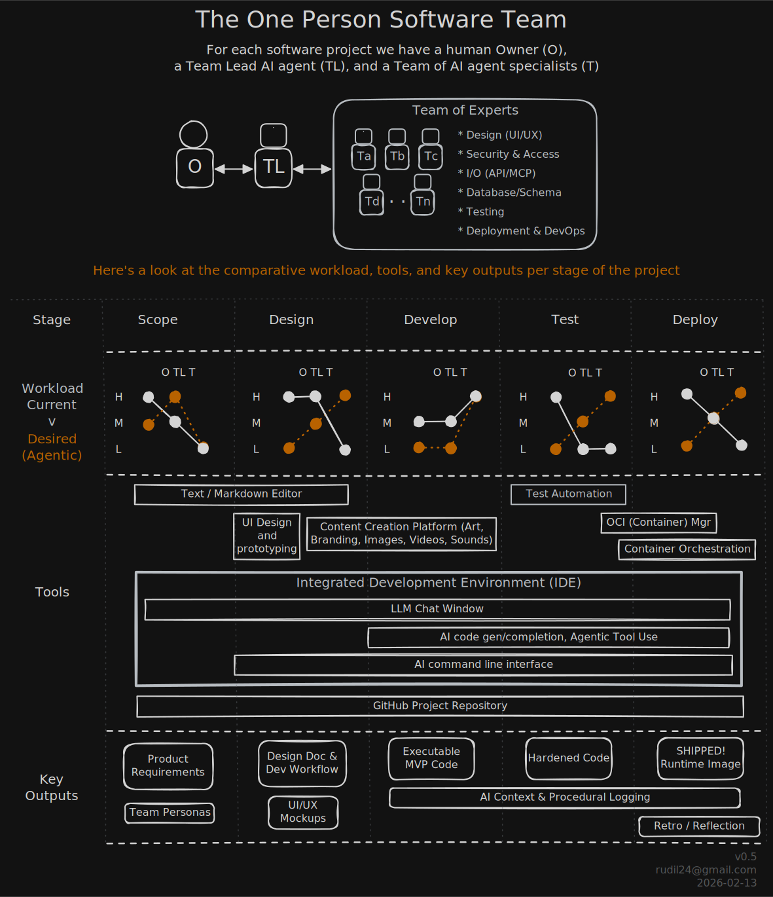

# One Person Software Team - rudil24

Documenting how I'm building agentic teams and workflows and improving incrementally.

## Background

This started in July 2024 after I was WFR'ed from Intuit. After a month of feeling sorry for myself,
I wrote this on some site somewhere:
> __My Why:__
> Career PM ang PgM here, but with a BSEE degree. \
> That's like __learning shipbuilding to become a cruise director__. \
> Don't get me wrong, PMs do important awesome talented work to vision a product, \
> while maintaining deep empathetic views for a multiverse of customers. \
> And PgMs keep wonderfully multi-tiered ToDo lists & cheer on people doing the work... \
> I had a great time doing both of those, but I'm aged out. \
> The growth path for me became middle management *jibber-jabber jobs*, \
> where the politics of self-preservation greatly outsize the customer impact. \
> The next place I work, __I'd like to be holding a hammer, not a fiddle.__ \
> So I'm going back to my 1s and 0s roots, diving deep into fullstack webdev, and loving it!

With that I put together a learning plan:

* Learned the PERN Stack and dabbled in blockchain development (Motoko)
* Learned prompt-window level LLM assistance at coding (GitHub copilot, WindSurf, Supermaven, and Gemini)
* Messed around with some keystones & pet projects
* Kept hitting the Copilot & Gemini free limits like a crack addict
* Purchased Google AI Pro in August 2025
* Made some more useful stuff
* Went through entire Python training using markdown README.md's as PRD and Design Doc.
  * didn't JUST use AI, got a solid working knowledge of the Python/Flask/SQLAlchemy Stack (and dabbled in data science via Jupyter Notebooks)

So now I'm ready to go agentic!

## Development Goals

My current goal is to reduce friction between human and agentic, make truly sublime agentic workflows.
Use that to make some useful and/or fun projects that serve a productivity and/or entertainment purpose in my life.
With the knowledge gained from that, I'll look at or career as a dev or making products.

## My One Person Environment(s)

### The Team

#### Product Owner

#### Team Lead

#### T-Shaped Team

In my, David always talks about "T-shaped people". "T-shaped agents", they are all fluent in any of the coding languages I know,
but

### The Workload - Current and Future

Currently I'm coding projects, i want to move to agentic and do it in two paths: A Google path and a Claude path.
I'm picking those because I think they "win" in the end, for software app development, at least.

### The Tools

#### Google Stack (using Google AI tools wherever possible)

#### Claude Stack (hybrid best-in-class)
Google Stack

#### Deployment Environments
Serverless: AWS, Azure, Google Cloud, 
Firebase, Heroku, Netlify, PythonAnywhere, Railway, Render, Vercel, ...

### Key Outputs

* Context Logging: What the team did, how it worked, for future 

## References

* [Claude Opus 4.6 In Depth Agentic Testing - John Sorrentino](https://www.youtube.com/watch?v=9ac8NLqMkGsP)