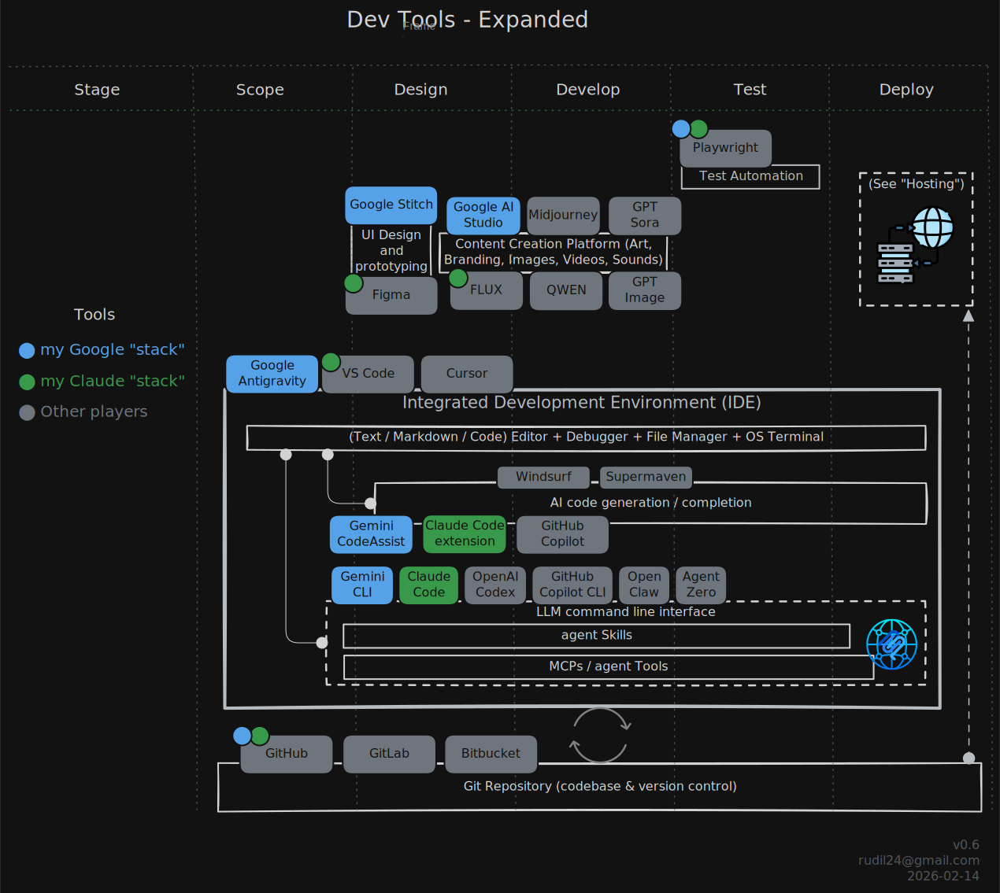

# One Person Software Team - Rudi Lewis

This repo captures how I'm building an AI software team and improving the agentic workflows iteratively over a number of projects. You can see more about [my background](./docs/background.md).

## Project Goals

1. My current goal is to create __*silky smooth agent-powered workflows*__, specifically in the software space. To achieve this, I'll iterate on my current clunky workflows, as I work through useful and/or fun projects that serve a productivity and/or entertainment purpose in my life and those around me.

2. My long-term goal is to build or join a viable business with the hardened team and workflows I create, with like-minded individuals who want to steer the world toward human/AI harmony, and hopefully __NOT__ "Beyond Thunderdome".

## Rev 0.1: Vibe + Chat (Aug 2025)

My first effort wasn't really a team as much as a Gemini chat session to build a quick & dirty 100% client-side [fantasy draft ping pong ball hopper](https://github.com/rudil24/draftballs), as I was learning React. It helped me see I wanted something more than chat + vibing to make things, I wanted to build an AI scrum team.

## Rev 0.2: Anatomy of a Team (Oct 2025)

I worked with Gemini 2.5 to create a ["team" roster (initial version)](https://github.com/rudil24/guestbook/tree/main/team) and we worked together through interactive prompts to create a simple javascript full stack [guestbook demo](https://github.com/rudil24/guestbook). I envisioned having an agent lead the action of agent experts. But all it really became was me talking to Gemini in a chat pane, then Gemini would drop below the counter and put on a new hat like a Monty Python hotel sketch. I had to "Deactivate agent Stella. Activate agent Nexus" and micro-manage almost every task. It got the project done, but with too much effort on my part.

## Rev 0.3: I Plan, You Do (Jan 2026)

I worked through the first 80 days of 100 Days of Code learning the Python language while refining my approach. I tried to NOT do interactive chats (other than for bug convos), and NOT to focus on the pseudo-team but work on my planning and setup instead. Instead, I'd pre-plan and start the project with a single prompt that pointed Gemini to a README.md that served as kind of a combined Product Requirements Doc and Design/Dev Workflow doc. Examples:

* [day031](https://github.com/rudil24/pythonCourse/tree/main/solutions/day031)
* [day064](https://github.com/rudil24/pythonCourse/tree/main/solutions/day064)
* [day082](https://github.com/rudil24/morse_code)

## Rev 0.4: One Team, Two Stacks (Feb 2026)

With only a couple weeks left in the Python 100 Course, the assignments get more complex. It's time to transition to agentic teams. The strategy is to build __one team__ that grows its __knowledge, memory, and teamwork__ as it works through successive projects. The team should be uncoupled from the AI-enabled product development tools "stack" it is using. In other words, the knowledge and skills stays with the team, and they should be able to plug and play into different dev languages and tool environments.

Can I build a true agentic team that will coordinate efforts AND work autonomously, within scope, and take that knowledge forward for future projects? Anthropic thinks I can, __if__ I use Claude Code and the latest (Opus 4.6) tools. Google also thinks I can, __if__ I use their new Antigravity integrated development environment (IDE) combined with their Gemini 3.0 Pro agentic workflows. Who's right? Let's try both! I'll use:

* A __Google__ "integrated" stack featuring Google Antigravity IDE, Google Stitch for wireframes, Google AI Studio for any multimedia assets, and Google CLI for managing the team and the action at the command line.
* A __Claude Code__ "best in class" stack that features the tried and true VS Code for the IDE, Figma for wireframes, a Flux2 integration with Black Forest Labs for graphics needs, and of course Claude Code managing the team and the action at the command line.

For more details about the dev tools, see [docs/devTools.md](./docs/devtools.md)

My hope is that 

### The Team

#### Product Owner

#### Team Lead

#### Team of Agent Specialists

In my, the great instructor [David McLachlan](https://www.youtube.com/channel/UC8uqqZwyoW303ZeWyUiNdMg) always talks about "T-shaped people". "T-shaped agents", they are all fluent in any of the coding languages I know,
but

### The Process

Project management

* Scope & feasibility: looking to move from high workload to a more managed approach
* Design: I'm looking to 
* Development
* Test
* Deploy. All of this is hokum if I don't __ship real code__.

### The Workload

### The Tools

For my Google "stack" I try to source Google products wherever I can.
My Claude "stack" uses Claude/Anthropic products wherever it can, 
and best in class wherever it cannot (unless Google IS best in class, 
then it uses a viable option. example: FLUX instead of Google NanoBanana for image gen)

#### Deployment Environments

Serverless: AWS, Azure, Google Cloud,
Platform as a Service: Firebase, Heroku, Hostinger, Netlify, PythonAnywhere, Railway, Render, Vercel, ...
I did a breakdown of how to host python/flask apps on [Python-primed PaaS](https://github.com/rudil24/pythonCourse/blob/main/solutions/day071/README.md)

### Key Outputs

* Context Logging: What the team did, how it worked, for future 

## References

* [How ClaudeCode Works](https://code.claude.com/docs/en/how-claude-code-works)
* [YouTube: Anthropic's 7 Hour Claude Course in 27 minutes](https://www.youtube.com/watch?v=XuSFUvUdvQA)
* [YouTube: Every Level of Claude Code Explained in 39 Minutes](https://www.youtube.com/watch?v=Y09u_S3w2c8)
* [YouTube: Learn 90% Of Claude Code Agent Teams in 22 Minutes (Opus 4.6)](https://www.youtube.com/watch?v=cSkoaCCmq0w)
* [Use Claude Code in VS Code](https://code.claude.com/docs/en/vs-code)
* [YouTube: Claude Opus 4.6 In Depth Agentic Testing - John Sorrentino](https://www.youtube.com/watch?v=9ac8NLqMkGsP)
* [YouTube: Gemini CLI vs Claude Code vs Codex Compared! What AI CLI is Best? (Sep 2025)](https://www.youtube.com/watch?v=zD0khfZGo3I)
