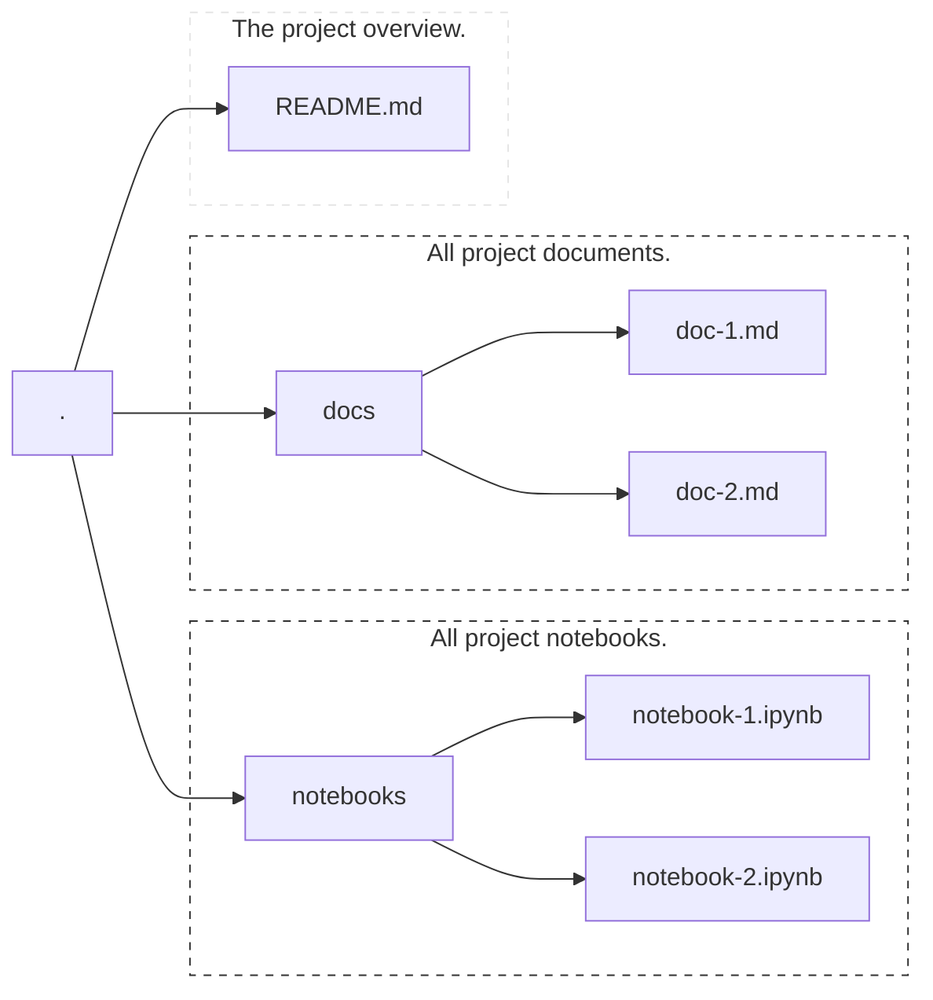

# Diagram Scratchpad

Doodles of diagrams made with [mermaid](https://mermaid-js.github.io/mermaid/#/).

## Project structure

The diagram below (except the helper text) was generated using the `tree -L 2` command.

<!-- prettier-ignore-start -->
<!-- Don't forget the two tabs! -->
    .
    ├── README.md             <- The project overview.
    ├── docs                  <- All project documents.
    │   ├── doc-1.md
    │   └── doc-2.md
    └── notebooks             <- All project notebooks.
        ├── notebook-1.ipynb
        └── notebook-2.ipynb
<!-- prettier-ignore-end -->
