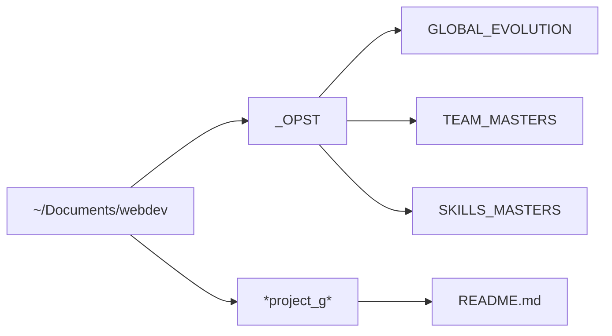

# OPST Continuous Improvement Strategy (Team Memory)

The One Person Software Team will constantly improve by creating a writable file structure that lives "above" the project level, but can be accessed from project to project.

